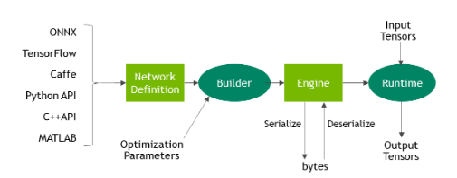

# TensorRT(Python)


## 环境
`docker pull fusimeng/tensorrt:10.2-7.0`
1. CUDA 10.2 cuDNN 7.6
2. Tensorrt 7.0
3. Opencv(GPU) 4.2

## 代码使用


### PTH to ONNX
`python pth2onnx.py -c 配置文件的路径 --model pth文件的路径 --model_out onnx文件的输出路径 --image 输入图片的路径 `

### ONNX to Engine， Engine to Runtime
`python onnx2trt.py -c 配置文件的路径 --onnx onnx文件的路径 --model pth文件的路径 --engine trt engine文件路径 --images 输入图片的路径`

### 结构
```
ssh://root@gpu.aiserver.cn:46068/usr/bin/python3 -u /root/cds/classification/deploy/tensorrt_python/onnx2trt.py
Namespace(configs='../../saved/OLED-Resnet18/04-28_09-02/configs.json', engine='oled_resnet.engine', images='oled_one', model='../../saved/OLED-Resnet18/04-28_09-02/best_model.pth', onnx='oled_resnet18.onnx')
Loading ONNX file from path oled_resnet18.onnx...
Beginning ONNX file parsing
[TensorRT] WARNING: Calling isShapeTensor before the entire network is constructed may result in an inaccurate result.
Completed parsing of ONNX file
Building an engine from file oled_resnet18.onnx; this may take a while...
Completed creating Engine
[TensorRT] WARNING: Current optimization profile is: 0. Please ensure there are no enqueued operations pending in this context prior to switching profiles
  0%|                                                                         | 0/1 [00:00<?, ?it/s][TensorRT] WARNING: Explicit batch network detected and batch size specified, use enqueue without batch size instead.
100%|████████████████████████████████████████████████████████████████| 1/1 [00:00<00:00, 438.55it/s]
Inference time with the TensorRT model: 0.003827810287475586
Inference result: [array([ 7.493896  , -2.347594  , -0.6206987 , -1.6629304 , -2.1027129 ,
        2.9506874 ,  1.4629362 , -0.50333786, -2.9737246 , -1.3985405 ,
       -3.4913301 ], dtype=float32)]
running on device cuda:0
Loading base network...
loaded weight
100%|████████████████████████████████████████████████████████████████| 1/1 [00:00<00:00, 193.15it/s]
Inference time with the PyTorch model: 0.005491018295288086
Inference result: [array(0)]
MSE Error = 9.393638610839844
```
